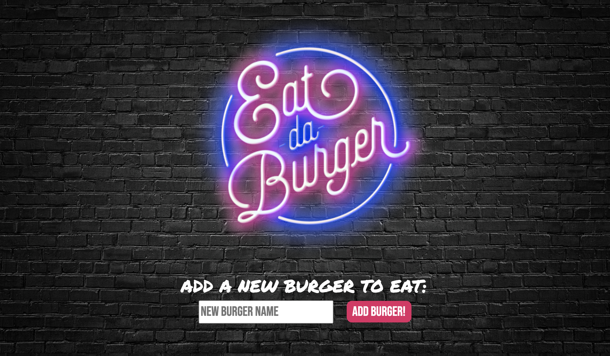
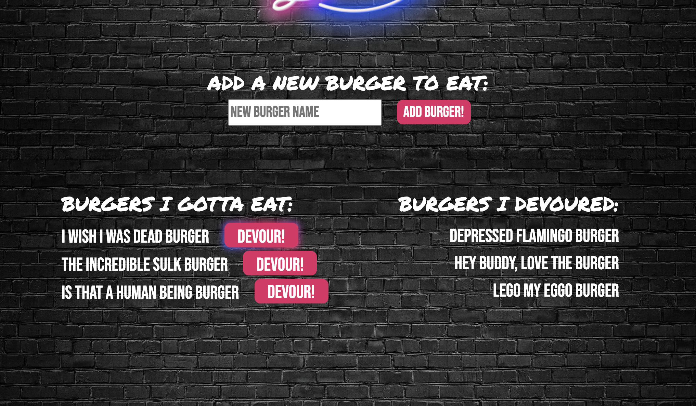
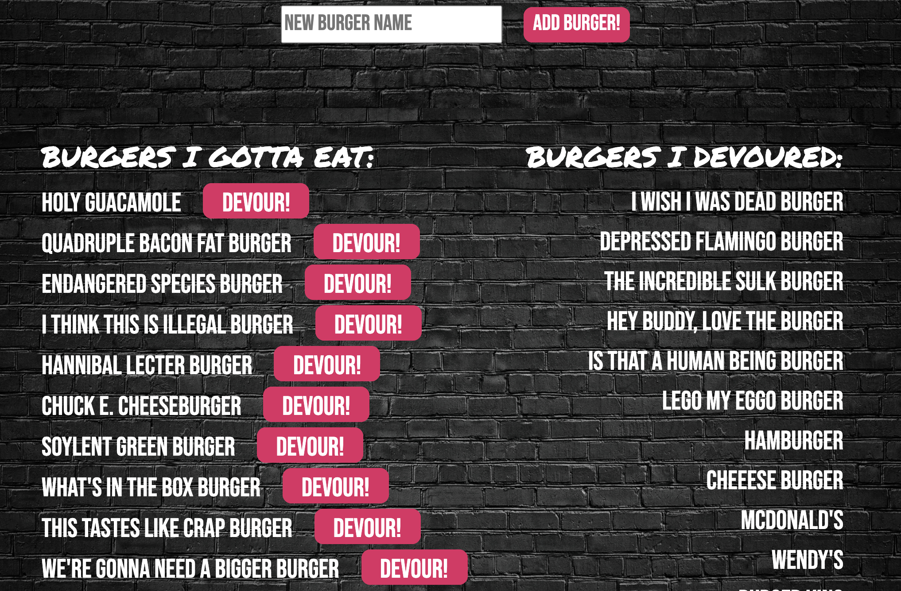

# Eat-Da-Burger
Eat-Da-Burger is a restaurant app that lets users input the names of burgers they'd like to eat. Once a new burger has been entered, it will display on the list of `BURGERS I GOTTA EAT`. The user then can click the `DEVOUR` button, which will move the burger to the list of `BURGERS I DEVOURED`. This app uses the MVC design pattern, and uses Node, MySQL, Handlebars, Express, Bootstrap, is deployed using Heroku, and includes an app logo created in Adobe Photoshop and Illustrator by Danny Fraley.

## Table of Contents
* [Installation](#installation)
* [Usage](#usage)
* [License](#license)
* [Contributing](#contributing)
* [Tests](#tests)
* [Questions](#questions)

## Installation
**To run the app on your local server:**
1. Go to https://github.com/dannyfraley/eat-da-burger and download the zip file to your local network.
2. Unzip the file.
3. Using your terminal command line program, navigate to the unzipped folder.
4. Type the command `npm i` to install the dependencies to your local folder.
5. Open MySQL Workbench and use the `schema.sql` file to create the necessary tables for this application.
6. Type the command `node server.js` to begin using the application. The user prompts will now begin to appear in the terminal.

**To use the deployed app:**
1. Go to https://agile-savannah-57013.herokuapp.com/

## Usage
1. The user is greeted with a flashing neon logo for the Eat-Da-Burger app.
2. From the main screen, the user can input the name of a new burger, or choose one of the prepopulated burger choices.
3. Any new burger that is added is then saved to the database and appears in the `BURGERS I GOTTA EAT` column.
4. Once the name of the burger appears in the `BURGERS I GOTTA EAT` column, the user has the ability to click the `DEVOUR` button next to it, which relocates the burger name to the `BURGERS I DEVOURED` column.

## License 
This application has been created under the MIT License license.

Copyright (c) 2020 Danny Fraley

Permission is hereby granted, free of charge, to any person obtaining a copy
of this software and associated documentation files (the "Software"), to deal
in the Software without restriction, including without limitation the rights
to use, copy, modify, merge, publish, distribute, sublicense, and/or sell
copies of the Software, and to permit persons to whom the Software is
furnished to do so, subject to the following conditions:

The above copyright notice and this permission notice shall be included in all
copies or substantial portions of the Software.

THE SOFTWARE IS PROVIDED "AS IS", WITHOUT WARRANTY OF ANY KIND, EXPRESS OR
IMPLIED, INCLUDING BUT NOT LIMITED TO THE WARRANTIES OF MERCHANTABILITY,
FITNESS FOR A PARTICULAR PURPOSE AND NONINFRINGEMENT. IN NO EVENT SHALL THE
AUTHORS OR COPYRIGHT HOLDERS BE LIABLE FOR ANY CLAIM, DAMAGES OR OTHER
LIABILITY, WHETHER IN AN ACTION OF CONTRACT, TORT OR OTHERWISE, ARISING FROM,
OUT OF OR IN CONNECTION WITH THE SOFTWARE OR THE USE OR OTHER DEALINGS IN THE
SOFTWARE.

## Contributing
Danny Fraley is currently the sole contributor to this project. If you are interested in contributing, feel free to do so in another branch.

## Tests
Testing performed in VS Code, manually by Danny Fraley.

## Questions
For question about using this application, please contact me at one of the links below.

<a href='https://www.github.com/dannyfraley'>github.com/dannyfraley</a>

<a href='mailto:dannyfraley@gmail.com'>dannyfraley@gmail.com</a>
